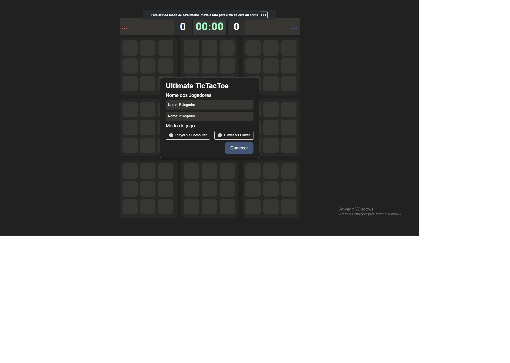
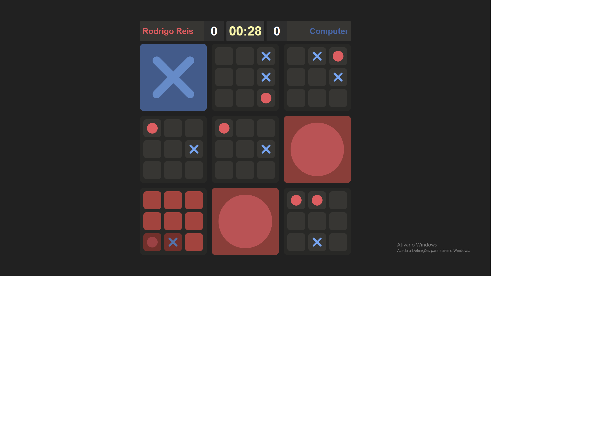
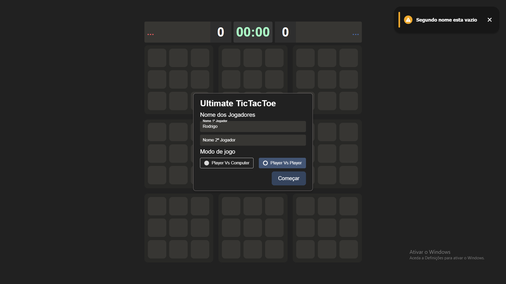

# Ultimate Tic-Tac-Toe

## Descrição

Este é um projeto desenvolvido como trabalho da disciplina Linguagens Script da Universidade ISEC. O objetivo do trabalho era criar o jogo "Ultimate Tic-Tac-Toe" utilizando React, FontAwesome para ícones e diversos componentes personalizados.

O Ultimate Tic-Tac-Toe é uma variação do clássico jogo da velha, no qual são utilizados nove tabuleiros menores agrupados em um tabuleiro maior. 
O objetivo é vencer três tabuleiros em sequência para ganhar o jogo.

## Como Instalar/Usar

1. Clone o repositório do GitHub:
git clone https://github.com/Rreis019/Ultimate-Tic-Tac-Toe.git

2. Navegue até o diretório do projeto:
cd Ultimate-Tic-Tac-Toe

3. Instale as dependências:
npm install

4. Inicie o servidor de desenvolvimento:
npm run dev

5. Abra o jogo em seu navegador, acessando `http://localhost:3000`.

## Imagens
Aqui estão algumas capturas de tela do jogo:

### Tela de Título

### Jogo em Andamento

### Erro - Nome Faltando

